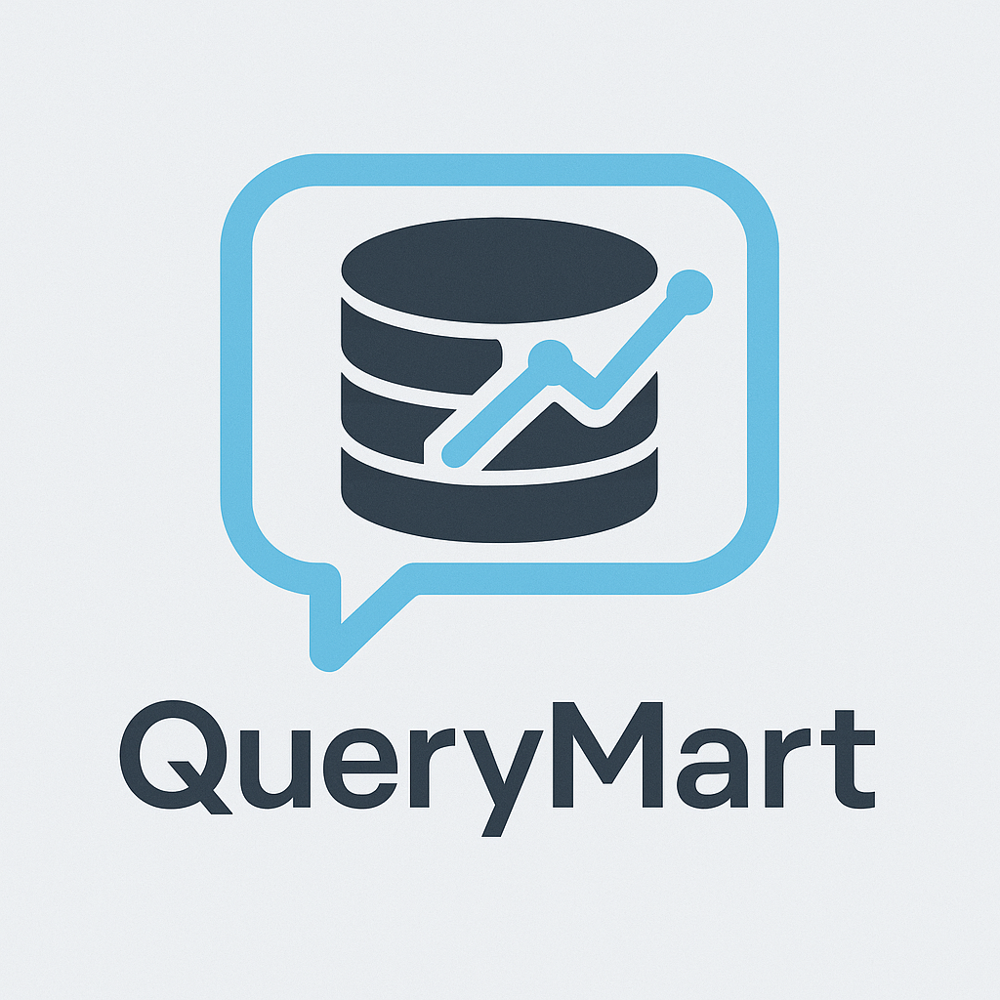

<p align="center">
  
</p>

<h1 align="center">QueryMart</h1>

<p align="center"><b>Natural Language Data Mart using Northwind + LLMs</b></p>

# QueryMart

**Natural Language Data Mart Project using Northwind + LLMs**

---

## 🚀 Project Highlights
- Designed and implemented a Star Schema using dbt (staging → intermediate → marts)
- Hosted and transformed data in PostgreSQL
- Built dynamic dashboards with Metabase
- Integrated LangChain to allow users to ask business questions in plain English and receive SQL-powered results

---

## 🎯 Business Questions We're Solving
- What are the top-selling products?
- Who are our most valuable customers?
- What’s the monthly sales trend?
- And more — all answered through data marts and natural language!

---

## 🧠 Tech Stack
`dbt`, `PostgreSQL`, `LangChain`, `Metabase`, `Python`

---

## 📂 Project Structure

```
querymart/
│
├── dbt_project/           # dbt models (staging → intermediate → marts)
├── langchain_app/         # Natural Language query interface using LangChain
├── metabase_exports/      # Dashboard configurations
├── docs/                  # Documentation and architecture diagrams
├── .gitignore             # Git ignore rules
├── requirements.txt       # Python dependencies
└── README.md              # You're here!
```

---

## ⚙️ Installation

```bash
git clone git@github.com:waseeqhaider/QueryMart.git
cd QueryMart
python -m venv venv-querymart
source venv-querymart/Scripts/activate  # On Windows
pip install -r requirements.txt
```

---

## 🤖 Natural Language Query Examples

> "Who are the top 5 customers?"  
> "Monthly sales trend of Beverages category"

---

## 📘 License
MIT
